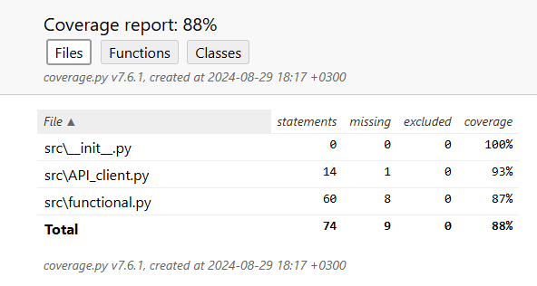

# Курсовая работа по курсу ООП
#### Этот проект представляет собой парсер вакансий с сайта HeadHunter, который позволяет пользователям искать, фильтровать и сохранять информацию о вакансиях.
### Функциональность

1. **Поиск вакансий**: 
   - Пользователь может ввести ключевое слово для поиска вакансий на HeadHunter.
   - Программа отображает первые 10 найденных вакансий.

2. **Отображение топ N вакансий по зарплате**:
   - Пользователь может выбрать количество вакансий для отображения.
   - Программа сортирует вакансии по зарплате (от высшей к низшей) и показывает указанное количество.

3. **Поиск вакансий по ключевому слову и сохранение в JSON**:
   - Пользователь может ввести поисковый запрос и дополнительное ключевое слово для поиска в описании вакансий.
   - Программа фильтрует вакансии по наличию ключевого слова в описании.
   - Отфильтрованные вакансии сохраняются в JSON файл.

4. **Обработка ошибок и повторные попытки**:
   - При возникновении проблем с доступом к странице вакансии, программа делает несколько попыток получить данные.

## Основные классы

- `APIClient`: Абстрактный базовый класс для API-клиентов.
- `HeadHunterAPI`: Класс для работы с API HeadHunter.
- `Vacancy`: Класс для представления информации о вакансии.
- `JSONSaver`: Класс для сохранения вакансий в JSON файл.

## Как использовать

1. Запустите скрипт.
2. Выберите одно из действий в меню:
   - Поиск вакансий
   - Показать топ N вакансий по зарплате
   - Поиск вакансий по ключевому слову и сохранение в JSON
   - Выход

3. Следуйте инструкциям на экране для каждого действия.

## Зависимости

- requests
- beautifulsoup4

## Установка и запуск

1. Склонируйте репозиторий
2. Установите зависимости: `pip install -r requirements.txt`
3. Запустите скрипт: `python main.py`

## Покрытие тестами:
